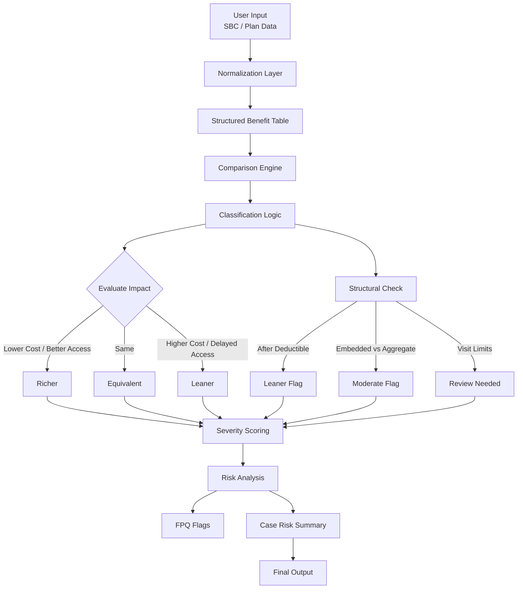
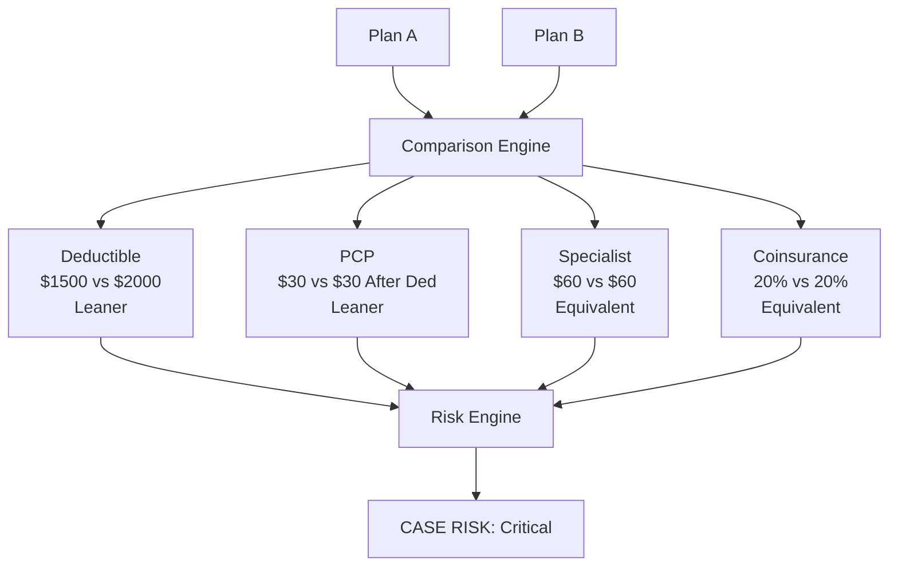

##  Live Demo

Try the interactive Plan Comparison Demo:

[Open Demo](https://codesandbox.io/p/devbox/yp8jv2)
💻 Built using React
✅ No proprietary data used  
✅ Demonstrates decision logic & explainability
``
---

### What this demo shows:
- Scenario-based plan comparison
- Equivalent, Richer, Leaner classification
- Structural difference detection (e.g., before vs after deductible)
- Severity-based risk scoring

## Overview

This is a non-proprietary sample demonstrating how structured plan data can be compared using rule-based logic.

The goal is to simulate how an AI-powered system could:
- Normalize plan benefit data
- Identify cost differences
- Detect hidden structural risks
- Produce consistent, explainable outputs

## How to Use

1. Select a scenario from the dropdown
2. Review the benefit comparisons
3. Observe classification results:
   - Richer
   - Equivalent
   - Leaner
4. Review severity scoring and overall risk

``

## Demo Code

View the logic in: `/PlanComparisonDemo.jsx`

# Plan-Comparison-Tool-for-Insurance-Coders
This tool allows insurance coders to compare existing benefits to company benefit offerings so that benefits can be properly mapped to comparable or richer benefits.
# Plan Comparison AI (Mock Prototype)

## Overview

This project demonstrates the design of an AI-powered comparison assistant that evaluates differences between two structured plans (e.g., insurance, pricing models, or service tiers).

The goal is to show how AI can:
- Extract structured data from unformatted inputs
- Normalize and compare key attributes
- Classify differences based on defined logic
- Identify potential risks or gaps

This is a **mock implementation** for demonstration purposes only.  
All business logic is generalized and does not reflect any proprietary systems.

---

##  Problem Statement

Comparing complex structured plans is:
- Time-consuming
- Prone to human error
- Inconsistent across analysts

Users often struggle to determine:
- Whether two plans are equivalent
- Where meaningful differences exist
- If changes increase cost or reduce value

---

## Solution Concept

This AI assistant follows a structured decision system:

1. Normalize inputs into comparable categories  
2. Perform side-by-side comparison  
3. Classify differences using rule-based logic  
4. Flag risks based on impact  

---

## Core Logic (Simplified)

### Step 1: Normalize Data

Convert input into consistent categories:

- Base cost / threshold
- User fees or charges
- Limits or caps
- Access structure
- Optional features

---

### Step 2: Comparison Engine

| Category | Plan A | Plan B | Classification |
|----------|--------|--------|----------------|

---

### Step 3: Classification Rules

The system evaluates differences based on **impact to the end user**.

#### Value Comparison

| Condition | Classification |
|----------|--------------|
| Lower cost / more access | Better |
| Equal value | Equivalent |
| Higher cost / less access |  Worse |

---

### Step 4: Structural Evaluation (Critical)

Even if values match, structure is evaluated:

Examples:
- Immediate access vs delayed access
- Flat fee vs percentage-based fee
- Individual vs grouped limits

If structure increases cost or limits access → classified as "Worse"

---

### Step 5: Risk Scoring

Each difference is assigned severity:

| Score | Meaning |
|------|--------|
| 3 | High impact change |
| 2 | Structural difference |
| 1 | Minor / no impact |
| 0 | Insufficient data |

---

## Example Output


Comparison Results:

Base Cost: Worse (Higher cost in Plan B)
Access Structure: Worse (Delayed access condition)
Usage Fee: Equivalent

Risk Summary:

High impact difference detected
Structural mismatch identified


---

## Key Design Principles

- **Decision support, not automation**
- **No assumptions when data is missing**
- **Focus on user impact rather than raw values**
- **Consistent classification logic**

---

##  Architecture (Conceptual)


Input → Normalization → Comparison → Classification → Risk Analysis → Output

---

## Future Enhancements

- Add NLP extraction from PDFs
- Expand classification logic with edge cases
- Introduce explainable AI outputs
- Add confidence scoring

---

## Why This Project Matters

This prototype demonstrates:

- Structured AI workflow design
- Rule-based classification systems
- Risk-aware analysis logic
- Explainability in AI outputs

---

## Disclaimer

This project is a conceptual demonstration only.  
It does not represent real systems, policies, or business rules.

---
## System Flow Diagram


## Example Input
Compare Plan A vs Plan B

Plan A:
- Deductible: $1,500
- PCP: $30 (before deductible)

Plan B:
- Deductible: $2,000
- PCP: $30 (after deductible)
---
## Example Output
PLAN COMPARISON

Deductible:
Plan A: $1,500
Plan B: $2,000
Classification: Leaner
Severity: 3 (Critical)
Reason: Higher deductible increases member cost

PCP Visits:
Plan A: $30 before deductible
Plan B: $30 after deductible
Classification: Leaner
Severity: 3 (Critical)
Reason: Access delayed until deductible met

---

KEY FINDINGS:
- Deductible increase creates higher upfront cost
- Structural change delays access to care

---

FPQ FLAGS:
- Potential benefit reduction identified—review before proceeding
- Structural mismatch identified—copay applies after deductible

---

CASE RISK SUMMARY:
Highest Severity: 3
Overall Risk: Critical
``
---
## How to Use This Demo
1. Review sample input plans
2. Apply classification logic
3. Observe how structural differences impact outcomes
4. Review severity scoring and risk flags
---
## Visual Plan Comparison


##  UI Mockup (Concept)

```
--------------------------------------------------
|  Plan Comparison AI                          |
--------------------------------------------------

INPUT
----------------------------------------------
Plan A Data          | Plan B Data
--------------------|---------------------------
Deductible: $1500   | Deductible: $2000
PCP: $30            | PCP: $30 after deductible
Specialist: $60     | Specialist: $60
Coinsurance: 20%    | Coinsurance: 20%

[ Run Comparison ]

----------------------------------------------

OUTPUT

CASE RISK: Critical

PLAN COMPARISON
----------------------------------------------
Deductible     → Leaner (Severity 3)
PCP            → Leaner (Severity 3)
Specialist     → Equivalent (Severity 1)
Coinsurance    → Equivalent (Severity 1)

KEY FINDINGS
----------------------------------------------
- Higher deductible increases cost
- PCP requires deductible before access

FPQ FLAGS
----------------------------------------------
- Potential benefit reduction detected
- Access delay due to deductible structure

CONFIDENCE: High
----------------------------------------------
```
## Before vs After AI

### Before (Manual Comparison)

- Review multiple documents manually
- Interpret inconsistent terminology
- Compare benefits line-by-line
- Risk missing structural differences
- Inconsistent decision-making across users

Example conclusion:
"Plans look similar, proceed."

---

### After (AI-Assisted Comparison)

✔ Structured normalization of all benefits  
✔ Side-by-side comparison with classification  
✔ Detection of hidden structural risks  
✔ Severity-based risk scoring  
✔ Standardized output and reasoning  

Example conclusion:

- Deductible increase identified → Leaner
- PCP access delayed → Leaner (Critical)
- Structural mismatch detected

Final Output:
Critical Risk – Recommend validation before proceeding

---

### Key Improvement

| Capability | Before | After |
|----------|--------|-------|
| Consistency | Low | High |
| Speed | Slow | Fast |
| Risk Detection | Manual | Automated |
| Decision Support | Limited | Structured |
| Audit Readiness | Variable | Standardized |

```
``
